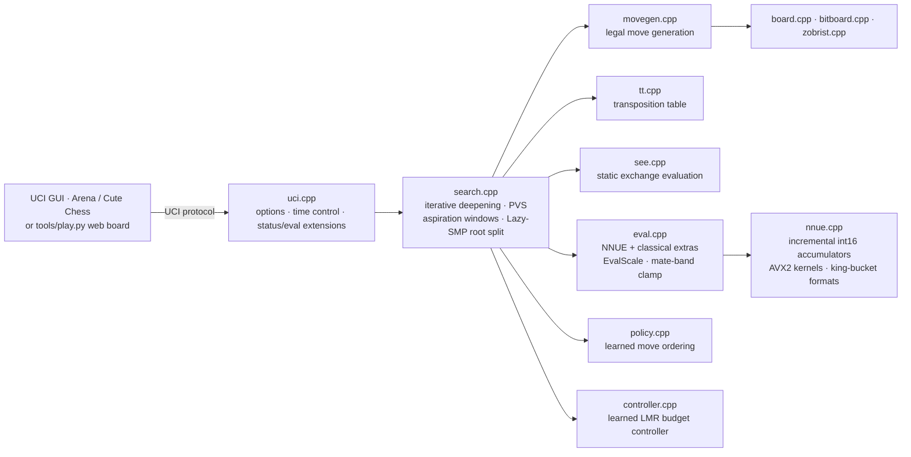
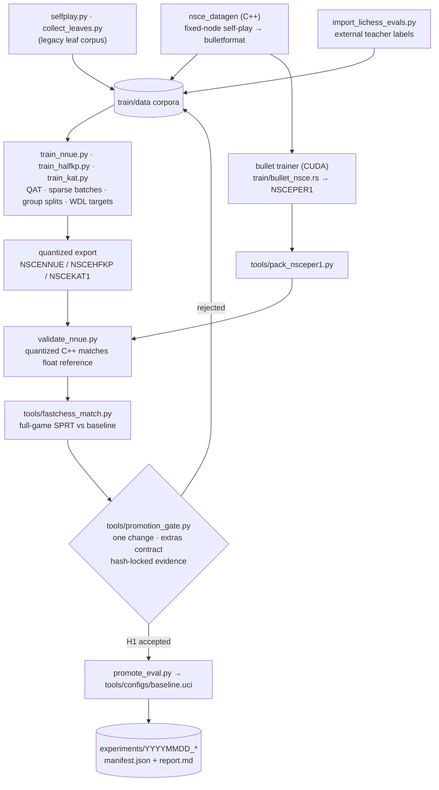

<div align="center">

# ♞ Optiline — NSCE Chess Engine

**A UCI chess engine pairing a modern alpha–beta searcher with quantized NNUE evaluation — shipped together with the fully gated, evidence-driven training pipeline that builds its networks.**

[](https://github.com/gonzalocolina/optiline/actions/workflows/ci.yml)
[](CMakeLists.txt)
[](CMakeLists.txt)
[](CMakeLists.txt)
[](train)
[](experiments/20260909_sf18_2200_rw0_n200/report.md)
[](LICENSE)

</div>

---

## Table of Contents

- [Overview](#overview)
- [Why This Project Stands Out](#why-this-project-stands-out)
- [System Architecture](#system-architecture)
  - [Engine Core](#engine-core)
  - [Training & Promotion Loop](#training--promotion-loop)
  - [Design Trade-offs](#design-trade-offs)
- [Directory Structure](#directory-structure)
- [Prerequisites & Installation](#prerequisites--installation)
- [Configuration & Usage](#configuration--usage)
  - [Play Against the Engine](#play-against-the-engine)
  - [UCI Session](#uci-session)
  - [UCI Options](#uci-options)
  - [Benchmarks & Datagen](#benchmarks--datagen)
  - [Training a Network](#training-a-network)
  - [Gating & Promotion](#gating--promotion)
- [Testing & Validation](#testing--validation)
- [Results & Metrics](#results--metrics)
- [License & Author](#license--author)

---

## Overview

**NSCE** is a complete chess program: for every position it builds a search tree of legal continuations, prunes it with alpha–beta and a full suite of modern reductions, and scores the leaves with a quantized neural network (NNUE) rather than a hand-crafted point recipe. The network judges the position; the tree chooses the move.

The repository contains two tightly integrated halves:

| Half | What it is | Tech |
| --- | --- | --- |
| [`engine/`](engine) | The playing engine: bitboards, move generation, PVS search, NNUE inference, UCI protocol, self-play datagen | C++20, CMake, AVX2 kernels |
| [`train/`](train) + [`tools/`](tools) | The pipeline that creates, validates, and promotes every network the engine ships | Python (stdlib + NumPy), fastchess, bullet trainer (CUDA, optional) |

The engine is explicitly engineered for **constrained hardware** — laptops and mobile-class machines — not for TCEC-style unlimited compute. The north star is pinned Stockfish builds at equal time per move; every strength claim in this repository is backed by an immutable experiment artifact under [`experiments/`](experiments).

**Current promoted baseline** ([`tools/configs/baseline.uci`](tools/configs/baseline.uci)): the `nnue_search_leaves40k_rw0` network defeats pinned Stockfish 18 limited to Elo 2200 by **+38 ± 36 Elo** over 200 games at 100 ms/move (95% CI lower bound **+2**), and the Elo 2000 rung by **+168 ± 114**. Unrestricted Stockfish is out of scope by design — and measured honestly (see [Results](#results--metrics)).

## Why This Project Stands Out

- **Full-stack ownership.** One repository covers the entire lifecycle: bitboard move generation → search → int16-quantized NNUE inference (AVX2) → self-play data generation in bulletformat → NumPy/bullet training → quantized export → full-game SPRT gating → promotion.
- **Evidence-driven promotion, not vibes.** Networks are never promoted on validation loss. Promotion requires a full-game fastchess SPRT, a single UCI change, an extras contract, and hash-locked artifacts validated by [`tools/promotion_gate.py`](tools/promotion_gate.py). MAE "rejects wreckage; it does not promote."
- **Rigorous measurement culture.** 80+ dated experiment dossiers under [`experiments/`](experiments), each with a `manifest.json` (engine SHA-256, opening-book SHA-256, seed, concurrency) and a `report.md`. Reference binaries (Stockfish 17/18/19/dev) are frozen and hash-pinned via [`tools/freeze_targets.py`](tools/freeze_targets.py).
- **Honest scope.** The engine's ceiling is measured and published, including the matches it loses.
- **Defense in depth.** GoogleTest suites (perft, board, NNUE, search, SEE, TT), Python contract tests, UCI smoke matches, bench smokes, and a 4-configuration CI matrix (Release, ASan+UBSan, TSan, stats build).

## System Architecture

### Engine Core



**Search** ([`engine/src/search.cpp`](engine/src/search.cpp)) implements the modern pruning canon, each technique individually toggleable over UCI for ablation studies:

- Principal Variation Search with aspiration windows and iterative deepening
- Transposition table with raw-eval substitution; correction history (pawn / non-pawn / continuation tables)
- Late Move Reductions (separate quiet/capture tables, rebuilt on tune), Late Move Pruning
- Null-move pruning with verification depth, razoring, reverse futility pruning, futility pruning
- ProbCut, SEE-based pruning and move ordering, singular extensions (incl. double extensions), internal iterative reductions
- Killers, history, capture history, continuation history, countermoves
- Quiescence search; parallel root splitting across a helper-thread pool (`Threads`, 1–64); pondering

**Evaluation** ([`engine/src/eval.cpp`](engine/src/eval.cpp), [`engine/src/nnue.cpp`](engine/src/nnue.cpp)) is NNUE-first with optional classical *extras* on top (`UseExtras`), clamped strictly outside the mate band. Four network formats are loaded from a single runtime:

| Format | Topology | Notes |
| --- | --- | --- |
| `NSCENNUE` | 768 → 128 → 1, int16 | The frozen, promoted baseline topology |
| `NSCEHFKP` | 16 king buckets × 768 | HalfKA-lite, dual accumulators |
| `NSCEKAT1` | 32 mirrored king buckets × 768 + 12-dim threat residual | HalfKA-hm style research path |
| `NSCEPER1` | Dual-perspective bullet nets: MLP (Chess768 FT L1=128 pairwise CReLU, L2=16 / L3=32 SCReLU, 8 output buckets) or Simple ((768→512)×2 SCReLU) | Current Elo path via the bullet trainer |

Two auxiliary learned components plug into the searcher: a compact **policy network** ([`policy.cpp`](engine/src/policy.cpp)) for move ordering, and a linear **search controller** ([`controller.cpp`](engine/src/controller.cpp)) fitted from LMR telemetry to suggest reduction deltas.

### Training & Promotion Loop



### Design Trade-offs

- **Int16 quantization everywhere.** AVX2 incremental accumulators trade a few centipawns of fidelity for the throughput that matters on laptop-class CPUs; training is quantization-aware (fake integer forward with straight-through gradients), and export is rejected if the conservative accumulator bound would overflow.
- **Frozen topology under contract.** The promoted 768×128×1 net is treated as an export contract: the quantized C++ forward pass must reproduce the frozen reference scores through [`train/validate_nnue.py`](train/validate_nnue.py) before any Elo gate runs.
- **Full games over truncated probes.** Legacy 60-ply ablation matches were demoted to telemetry after ~90% of games ended as adjudicated draws that couldn't resolve real strength; the gate is full-game fastchess with resign/draw adjudication.
- **Determinism of evidence.** Every experiment freezes engine hash, config hash, opening-book hash, and seed; Stockfish reference binaries are pinned by SHA-256, never copied into the tree.
- **CPU-first.** No GPU is required to build, play, test, or run the NumPy trainer. CUDA appears exactly once — as an optional local toolchain for the bullet trainer path ([`tools/setup_cuda_local.sh`](tools/setup_cuda_local.sh)).

## Directory Structure

```text
optiline/
├── CMakeLists.txt              # Build graph: engine lib, UCI binary, tests, benches, datagen
├── play.sh                     # One-shot: build (if needed) + serve the local board
├── LICENSE                     # GNU GPLv3
│
├── engine/                     # ── C++20 engine ─────────────────────────────
│   ├── include/nsce/           # Public headers (search, nnue, tt, board, …)
│   ├── src/                    # Engine sources: bitboard, board, movegen, zobrist,
│   │                           #   tt, eval, nnue, policy, controller, see, search,
│   │                           #   uci, perft, datagen, main
│   ├── tests/                  # GoogleTest: perft, board, nnue, search, see, tt
│   └── benches/                # bench_search · bench_nnue_latency ·
│                               #   bench_components · datagen_main
│
├── train/                      # ── Training pipeline (Python stdlib + NumPy) ─
│   ├── train_nnue.py           # QAT trainer for the frozen 768×128×1 topology
│   ├── train_halfkp.py         # 16-bucket king-relative path (NSCEHFKP)
│   ├── train_kat.py            # 32 mirrored buckets + threat residual (NSCEKAT1)
│   ├── distill.py              # Teacher labeling (e.g. Stockfish) via a sampler
│   ├── import_lichess_evals.py # Stream Lichess eval dumps → JSONL corpus
│   ├── validate_nnue.py        # Export gate: quantized C++ matches reference
│   ├── selfplay.py / collect_leaves.py   # Legacy corpus builders (frozen)
│   ├── fit_controller.py / collect_search_telemetry.py
│   ├── bullet_nsce*.rs         # bullet trainer examples (NSCEPER1)
│   └── tests/                  # unittest suites for the pipeline
│
├── tools/                      # ── Experiment infrastructure ────────────────
│   ├── fastchess_match.py      # Concurrent full-game matches · SPRT · Elo
│   ├── promotion_gate.py       # Immutable-evidence validation before promotion
│   ├── promote_eval.py         # Apply an accepted promotion to baseline.uci
│   ├── elo_ladder.py           # KPI ladder vs pinned Stockfish rungs
│   ├── freeze_targets.py       # SHA-256 pin of engine + Stockfish binaries
│   ├── play.py / play.sh       # Browser board (127.0.0.1:8765) + ASCII CLI
│   ├── ablation_match.py / sprt.py       # Legacy runners (telemetry only)
│   ├── configs/                # 40+ pinned UCI configs (baseline.uci = promoted)
│   ├── openings*.epd           # Balanced / UHO opening books
│   └── tests/                  # Contract tests for the tooling itself
│
├── nets/                       # Promoted quantized networks + metrics JSON
├── experiments/                # 80+ dated dossiers: manifest.json + report.md
├── third_party/stockfish/      # Pinned reference binaries (gitignored, hash-locked)
└── .github/workflows/ci.yml    # 4-build matrix: release · ASan+UBSan · TSan · stats
```

## Prerequisites & Installation

| Requirement | Version | Purpose |
| --- | --- | --- |
| CMake | ≥ 3.16 | Build system |
| C++ compiler | GCC or Clang with C++20 | Engine (`-std=c++20`, `-O3`, LTO, `-march=native`) |
| Python | ≥ 3.10 (+ `numpy`) | Training pipeline, match runners, web board |
| make / ninja | any | Parallel builds |
| *(optional)* Rust + CUDA 12.2 | — | bullet trainer path for `NSCEPER1` ([`tools/setup_bullet.sh`](tools/setup_bullet.sh), [`tools/setup_cuda_local.sh`](tools/setup_cuda_local.sh)) |
| *(optional)* llvm-mingw | — | Cross-compile a portable Windows AVX2+BMI2 binary via [`cmake/mingw-w64-x86_64.cmake`](cmake/mingw-w64-x86_64.cmake) |

**Build (Release, native optimizations, AVX2 NNUE kernels, LTO):**

```bash
cmake -S . -B build -DCMAKE_BUILD_TYPE=Release
cmake --build build -j"$(nproc)"
```

This produces `build/nsce` (UCI engine), `build/nsce_tests`, `build/nsce_bench*`, and `build/nsce_datagen`. Key CMake switches:

| Option | Default | Effect |
| --- | --- | --- |
| `NSCE_NATIVE` | `ON` | `-march=native` |
| `NSCE_AVX2` | `ON` | AVX2+FMA NNUE kernels (`NSCE_HAS_AVX2`) |
| `NSCE_LTO` | `ON` | Link-time optimization (IPO) |
| `NSCE_SANITIZE` | `OFF` | AddressSanitizer + UBSan build |
| `NSCE_TSAN` | `OFF` | ThreadSanitizer build (mutually exclusive with the above) |
| `NSCE_STATS` | `OFF` | Low-overhead search telemetry counters |
| `NSCE_TUNE` | `OFF` | Expose search constants as UCI spins for SPSA |
| `NSCE_PGO_GENERATE` / `NSCE_PGO_USE` | `OFF` | Two-pass profile-guided optimization |

## Configuration & Usage

### Play Against the Engine

```bash
./play.sh            # serves a local board at http://127.0.0.1:8765/
./play.sh --cli      # ASCII board in the terminal
```

`play.sh` builds the engine if `build/nsce` is missing, then launches [`tools/play.py`](tools/play.py) against the promoted baseline. Prefer a GUI? Point Arena, Cute Chess, or any UCI frontend at `build/nsce`.

### UCI Session

```text
$ ./build/nsce
uci
id name NSCE 0.10
...
uciok
setoption name Threads value 4
setoption name Hash value 64
position startpos
go depth 12
...
bestmove e2e4 ponder e7e5
```

Beyond the standard protocol, NSCE exposes diagnostic commands used by the pipeline: `bench [depth]`, `perft [depth]`, `d` (board dump), `status` (game-state oracle used as the match adjudicator), `legalmoves`, `eval` (detail breakdown), and `hashfull`.

### UCI Options

| Option | Type | Default | Range / Values |
| --- | --- | --- | --- |
| `Hash` | spin | 16 | 1–4096 MB |
| `Threads` | spin | 1 | 1–64 |
| `UseNNUE` | check | true | — |
| `EvalFile` | string | `nets/nnue_trained.bin` | path, or `internal` for the PST-distilled HCE init |
| `UseExtras` | check | true | classical terms on top of NNUE |
| `EvalScale` | spin | 1000 | 250–4000 (per-mille) |
| `UsePolicy` | check | false | learned move ordering (`PolicyFile`) |
| `UseSearchController` | check | false | learned LMR budget (`ControllerFile`) |
| `UseTT` · `UseSEE` · `UseLMR` · `UseNullMove` · `UseFutility` · `UseLMP` · `UseRazoring` · `UseRFP` · `UseProbCut` | check | true | per-technique ablation switches |
| `TelemetryFile` / `LeafTelemetryFile` | string | empty | search / leaf telemetry sinks |

### Benchmarks & Datagen

```bash
./build/nsce bench 8            # fixed-work search benchmark (also: tools/bench.py)
./build/nsce perft 6            # node-count correctness/throughput
./build/nsce_bench 8 1 1 internal        # search bench harness
./build/nsce_bench_nnue 100000 internal  # NNUE inference latency

# Self-play data generation (bulletformat, multi-threaded, adjudicated):
./build/nsce_datagen --out train/data/gen0.bin --games 1200000 --nodes 5000 \
  --threads 14 --eval-file nets/nnue_search_leaves40k_rw0.bin --seed 1
```

### Training a Network

```bash
python3 -m venv .venv
.venv/bin/python -m pip install numpy

# Quantization-aware training of the exact 768×128×1 topology the C++ consumes:
.venv/bin/python train/train_nnue.py \
  --data train/data/nsce_static_games.jsonl \
  --epochs 80 --seed 20260802 --target-mode wdl \
  --teacher-wdl-scale 400 --search-wdl-scale 400 \
  --result-weight 0.20 --residualize-extras --init internal

# Export gate: the quantized C++ forward pass must match the frozen reference.
.venv/bin/python train/validate_nnue.py \
  --engine build/nsce --data train/data/nsce_static_games.jsonl \
  --network nets/nnue_trained.bin --use-extras --gate clone
```

The full pipeline — HalfKP/KAT king-relative trainers, Lichess-streamed teacher labels, the bullet/CUDA path, controller fitting, and the legacy corpus builders — is documented in [`train/README.md`](train/README.md).

### Gating & Promotion

```bash
# Full-game SPRT gate: candidate vs baseline, tc 8+0.08, H0/H1 = [0, 5] nElo.
python3 tools/fastchess_match.py \
  --cfg-a tools/configs/baseline.uci \
  --cfg-b tools/configs/trained_nnue.uci \
  --tc 8+0.08 --sprt 0 5 --rounds 3000 \
  --outdir experiments/$(date +%Y%m%d)_eval_sprt
```

Only an accepted SPRT — one UCI change, extras contract satisfied, hash-locked artifacts — allows [`tools/promote_eval.py`](tools/promote_eval.py) to update `baseline.uci`.

## Testing & Validation

```bash
cmake -S . -B build -DCMAKE_BUILD_TYPE=Release
cmake --build build -j"$(nproc)"
ctest --test-dir build --output-on-failure
```

| Suite | What it proves |
| --- | --- |
| `nsce_tests` (GoogleTest, ~70 cases) | Perft from startpos & Kiwipete; FEN round-trips; legal-move/evasion correctness; incremental NNUE ≡ full refresh across captures/undos for **all four** net formats; mate-in-N search; parallel-root forced-mate preservation; TT semantics; SEE |
| `PythonExperimentTests` | Contract tests for the match/gating tooling ([`tools/tests`](tools/tests)) |
| `PythonTrainTests` | Trainer, self-play, and distill pipeline tests ([`train/tests`](train/tests)) |
| `UciSmoke` | A live 1-game match through the UCI protocol |
| `SearchBenchSmoke` · `NnueBenchSmoke` · `ComponentsBenchSmoke` | Bench harnesses execute cleanly |

Sanitizer and instrumentation builds mirror CI exactly:

```bash
cmake -S . -B build-asan -DCMAKE_BUILD_TYPE=RelWithDebInfo -DNSCE_SANITIZE=ON -DNSCE_LTO=OFF
cmake -S . -B build-tsan -DCMAKE_BUILD_TYPE=RelWithDebInfo -DNSCE_TSAN=ON  -DNSCE_LTO=OFF
```

CI ([`.github/workflows/ci.yml`](.github/workflows/ci.yml)) runs the full matrix — **release · ASan+UBSan · TSan · stats** — builds, executes `ctest`, and finishes with a multithreaded UCI search (`Threads=4, depth 8`) on every push and pull request.

## Results & Metrics

**Strength ladder** — NSCE (promoted baseline, `Hash 16`, `Threads 1`) vs pinned Stockfish 18 at 100 ms/move, paired colors from [`openings_balanced.epd`](tools/openings_balanced.epd):

| Opponent | Games | W–D–L (NSCE) | Elo ± 95% | Evidence |
| --- | ---: | ---: | ---: | --- |
| SF18 `UCI_Elo=2000` | 40 | 25–8–7 | **+168 ± 114** | [report](experiments/20260903_sf18_2000_rw0/report.md) |
| SF18 `UCI_Elo=2200` | 200 | 67–88–45 | **+38 ± 36** (lower bound +2) | [report](experiments/20260909_sf18_2200_rw0_n200/report.md) |
| SF18 unlimited | 100 | 0–1–99 | out of scope — published anyway | [report](experiments/20260915_sf18_unlimited_100ms/report.md) |
| *ablation:* prior handcrafted eval | 200 | 123–33–44 | **+145.1 ± 45.0** | [report](experiments/20260915_instrument_internal_full/report.md) |
| *regression guard:* frozen binary (8+0.08) | 300 | 129–45–126 | +3.5 ± 20.7 | [report](experiments/20260916_kpi_frozen/report.md) |

**Promoted network quality** — [`nets/nnue_search_leaves40k_rw0.bin`](nets/nnue_search_leaves40k_rw0.bin) (768×128×1, QAT, 79,999 samples, group-split holdout; quantized-int forward within 0.1 cp of the float reference):

| Phase | MAE (cp) | Sign accuracy |
| --- | ---: | ---: |
| Opening | 72.2 | 71.7% |
| Middlegame | 157.1 | 68.8% |
| Endgame | 205.2 | 71.3% |
| **Overall** | **146.1** | **70.0%** |

Full metrics: [`nets/nnue_search_leaves40k_rw0.metrics.json`](nets/nnue_search_leaves40k_rw0.metrics.json). Promotion SPRT for this net: accepted H1 at 490 games, LLR +2.97, +23 ± 9 Elo ([report](experiments/20260903_search_leaves40k_rw0_sprt/report.md)).

## License & Author

NSCE is distributed under the [GNU General Public License v3](LICENSE).

**Author:** Gonzalo Colina — [github.com/gonzalocolina](https://github.com/gonzalocolina)
